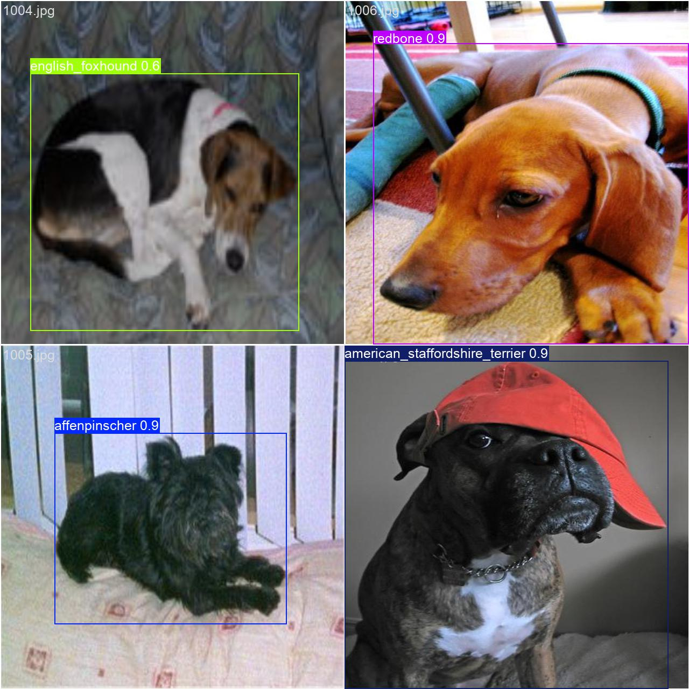
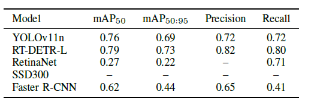
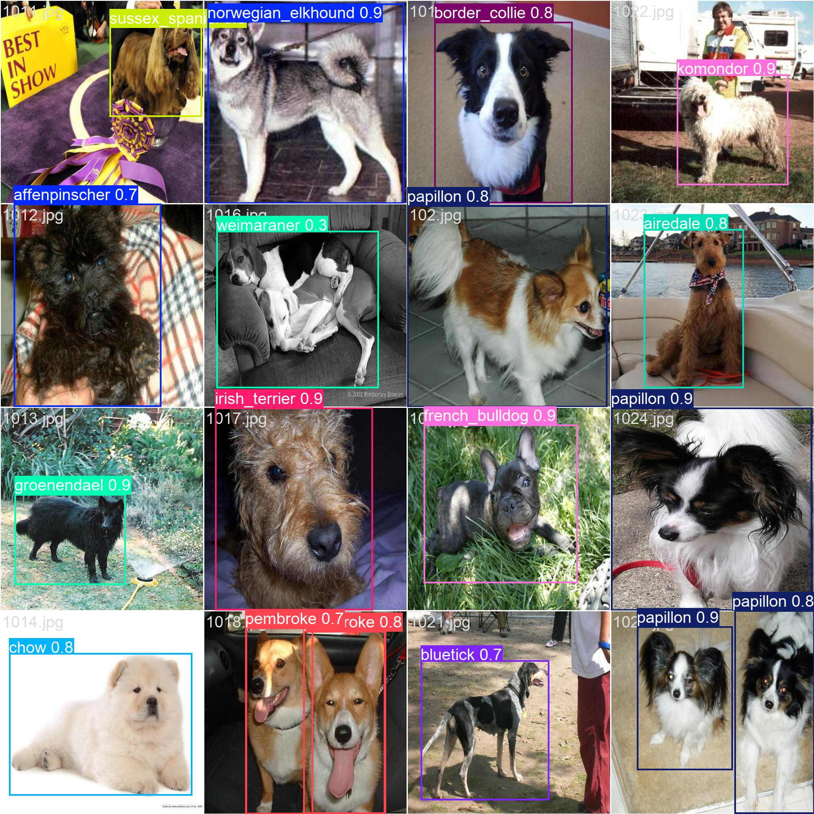

# Multiclass Dog Breed Detection & Classification

This project implements multiple state-of-the-art object detection models for detecting dogs in images and classifying them into their specific breeds. The project compares the performance of **YOLO**, **RetinaNet**, **SSD**, and **DETR (Detection Transformer)** models on the Stanford Dogs Dataset containing 120 different dog breeds.


*Comparison of different object detection models for dog breed classification*

## 🎯 Project Overview

This comprehensive computer vision project focuses on:
- **Object Detection**: Locating dogs in images with bounding boxes
- **Breed Classification**: Identifying specific dog breeds from 120 classes
- **Model Comparison**: Evaluating multiple SOTA detection architectures
- **Interactive Demos**: Web applications for real-time inference

### 🏆 Models Implemented

| Model | Framework | Backbone | mAP@0.5 | Inference Speed |
|-------|-----------|----------|---------|-----------------|
| **YOLOv11** | Ultralytics | CSPDarknet | 0.76 | ~21.69ms |
| **DETR** | Ultralytics | ResNet-50 | 0.79 | ~36.54ms |
| **FasterRCNN** | PyTorch | ResNet-50 | 0.62 | ~110.73ms |
| **RetinaNet** | PyTorch | ResNet-50 |  |  |
| **SSD** | PyTorch | MobileNet | TBD |  |


## 📊 Dataset

**Stanford Dogs Dataset**
- **Total Images**: 20,580
- **Dog Breeds**: 120 classes
- **Format**: JPEG images with PASCAL VOC annotations
- **Source**: [Stanford Vision Lab](http://vision.stanford.edu/aditya86/ImageNetDogs/)


*Sample images from different dog breeds in the dataset*

## 🚀 Quick Start

### Prerequisites

```bash
# Clone the repository
git clone https://github.com/your-username/Multiclass-Dog-Breed-Detection-Classification.git
cd Multiclass-Dog-Breed-Detection-Classification

# Create virtual environment
python -m venv venv
source venv/bin/activate  # On Windows: venv\Scripts\activate

# Install dependencies
pip install torch torchvision ultralytics gradio streamlit
pip install opencv-python pillow numpy matplotlib seaborn
pip install transformers datasets
```

### Dataset Setup

1. Download the Stanford Dogs Dataset from [here](http://vision.stanford.edu/aditya86/ImageNetDogs/)
2. Extract the files to the `data/` directory:
   ```
   data/
   ├── images/
   │   ├── n02085620-Chihuahua/
   │   ├── n02085782-Japanese_spaniel/
   │   └── ...
   └── annotations/
       ├── n02085620-Chihuahua/
       ├── n02085782-Japanese_spaniel/
       └── ...
   ```

## 🎮 Interactive Demos

### 1. YOLO Demo (Gradio)

The main Gradio application supports both image and video inference with YOLOv11:

```bash
python gradio_app.py
```


*YOLO real-time detection demo*

**Features:**
- Upload images or videos
- Real-time inference
- Adjustable confidence threshold
- Batch processing support


## 🏋️ Training

### YOLO Training

```bash
cd "Yolo and detr"/
python yolo_train.py
```

Configuration: [`yolo.yaml`](Yolo%20and%20detr/yolo.yaml)

### RetinaNet Training

```bash
cd RetinaNet/
jupyter notebook retinanet_v2.ipynb
```

### SSD Training

```bash
cd SSD/
jupyter notebook project_SSD.ipynb
```

### DETR Training

```bash
cd "Yolo and detr"/
python detection_transformer_train.py
```

## 📈 Results & Analysis

### Performance Metrics


*Comprehensive performance comparison across all models*

### Training Curves


*Loss and mAP curves during training*

### Qualitative Results


*Sample predictions from our best model Yolo*

## 📁 Project Structure

```
├── 📁 annotations/          # COCO format annotations
│   ├── dogs_coco.json
│   ├── train.json
│   └── val.json
├── 📁 data/                # Dataset directory
│   ├── images/
│   └── annotations/
├── 📁 EDA/                 # Exploratory Data Analysis
│   ├── yolo.ipynb
│   └── EDA.pdf
├── 📁 faster_rcnn_notebooks/  # Faster R-CNN experiments
├── 📁 RetinaNet/           # RetinaNet implementation
│   ├── retinanet_v2.ipynb
│   └── retinanet_app.py
├── 📁 SSD/                 # SSD implementation
│   ├── project_SSD.ipynb
│   └── ssd_app.py
├── 📁 Yolo and detr/       # YOLO & DETR implementations
│   ├── yolo_train.py
│   ├── detection_transformer_train.py
│   └── yolo.yaml
├── 📁 figures/             # Result visualizations
├── 📁 logs/                # Training logs
├── gradio_app.py           # Main YOLO demo app
└── preprocess.py           # Data preprocessing utilities
```

## 🔧 Advanced Usage

### Custom Training

To train on your own dataset:

1. Prepare annotations in COCO format
2. Update the class names in [`yolo.yaml`](Yolo%20and%20detr/yolo.yaml)
3. Modify the model configuration
4. Run training scripts

### Model Evaluation

```bash
# YOLO evaluation
cd "Yolo and detr"/
python analysis_file_yolo.py

# DETR evaluation  
python analysis_file_detc.py

# Generate plots
python plots_file.py
```
## 📝 License

This project is licensed under the MIT License - see the [LICENSE](LICENSE) file for details.


